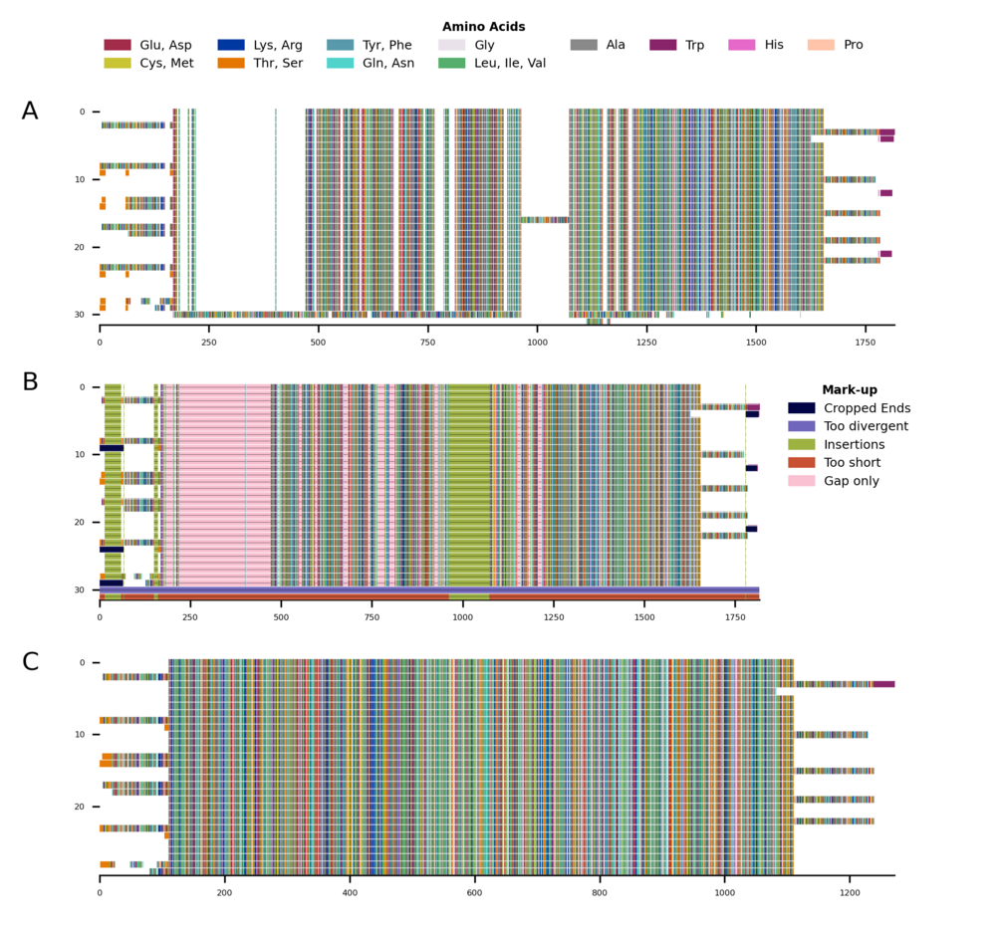

# CIAlign

CIAlign is a command line tool which performs various functions to clean, visualise and analyse a multiple sequence alignment (MSA).

1. [Summary](#summary)
2. [Citation](#citation)
3. [Mailing List](#mailing-list)
4. [Installation](installation.html)
5. [Manual](usage.html)

## Summary
CIAlign allows the user to:

**Clean**

* [Remove sources of noise from an MSA](usage.html#cleaning-functions) 
  * [Remove sequences](usage.html#remove-divergent) above a threshold level percentage of divergence from the majority.
  * [Remove insertions](usage.html#remove-insertions) which are not present in the majority of sequences.
  * [Crop poorly aligned](usage.html#crop-ends)  sequence ends.
  * [Remove short sequences](usage.html#remove-short) below a threshold number of bases or amino acids.
  * [Remove columns](usage.html#remove-gap-only) containing only gaps.
  * [Remove either end](cleaning_functions.html#crop_divergent) of an alignment where columns don't meet a minimum identity threshold and coverage level.

**Visualise**

* [Visualise alignments](usage.html#visualising-alignments).
  * Generate [image files](usage.html#mini-alignments) summarising the alignment.
  * [Label](usage.html#mini-alignments) these images to show how CIAlign has affected the alignment.
  * Draw [sequence logos](usage.html#sequence-logos)
  * Plot [alignment statistics](usage.html#analysing-alignment-statistics) - visualise coverage and conservation at each position in the alignment.

**Interpret**

* Generate [consensus sequences](usage.html#consensus-sequences).
* Generate [position frequency, position probability and position weight matrices](usage.html#position-frequency-probability-and-weight-matrices)
* Format these matrices to be used as input for the [BLAMM and MEME](usage.html#position-frequency-probability-and-weight-matrices) motif analysis tools.
* [Generate a similarity matrix](usage.html#similarity-matrices) showing the percentage identity between each sequence pair.
  
**Edit**

* [Extract a section](usage.html#extracting-sections-from-an-alignment) of the alignment.
* [Unalign](usage.html#unaligning-removing-gaps) the alignment.
* [Replace U with T, or T with U](usage.html#replacing-u-or-t) in a nucleotide alignment.

CIAlign is designed to be highly customisable, allowing users to specify exactly which functions to run and which settings to use.

It is also transparent, generating a clear log file and alignment markup showing exactly how the alignment has changed and what has been removed by which function.

## Citation
If you found CIAlign useful, please cite: 

[Tumescheit C, Firth AE, Brown K. 2022. CIAlign: A highly customisable command line tool to clean, interpret and visualise multiple sequence alignments. PeerJ 10:e12983 https://doi.org/10.7717/peerj.12983](https://peerj.com/articles/12983/)

## Mailing List
Sign up [here](https://t.co/tTyxFV6LR2) for updates when a new feature is added to CIAlign 
